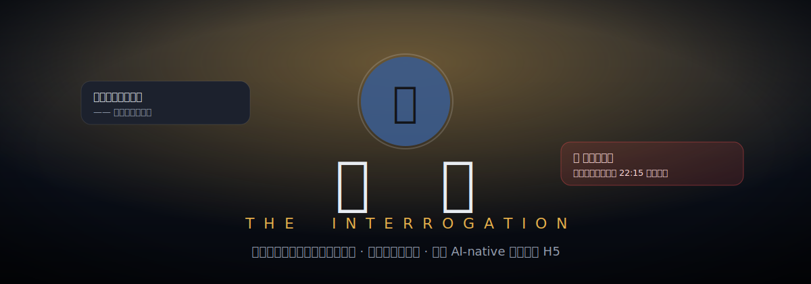

<p align="center">
  
</p>

<h1 align="center">盘问 · The Interrogation</h1>

<p align="center">
  一个 <b>AI-native</b> 推理探案 H5 小游戏 —— 审讯由大模型<b>实时驱动</b>的嫌疑人，从对话里找出破绽，用现场证据<b>当面击破谎言</b>，揪出真凶。
</p>

<p align="center">
  <a href="https://xzzzzc217.github.io/ai-interrogation/"><b>🎮 在线试玩 (Live Demo)</b></a>　·　
  <a href="docs/GAME-DESIGN.md">玩法设计</a>　·　
  <a href="docs/PROMPT-DESIGN.md">Prompt 设计</a>　·　
  <a href="docs/AI-WORKFLOW.md">AI 开发工作流</a>
</p>

<p align="center">
  
  
  
  
  
</p>

---

## 这是什么

《盘问》不是「用 AI 写出来的游戏」，而是一个 **「AI 本身就是核心玩法」** 的游戏。

你是登上私人游艇「海蓝号」的调查员。富商林国栋死在反锁的书房里，船上三名嫌疑人各执一词——其中一个在说谎。你需要：

1. **审讯**：分别和三名嫌疑人对话，他们由大语言模型实时扮演，各有隐藏的人设、不在场证明与秘密；
2. **找破绽**：从他们的话里嗅出矛盾；
3. **出示证据**：把对的证物甩到对的人脸上，当面击破谎言（致敬《逆转裁判》的「异议！」）；
4. **指认**：用足够的铁证把真凶钉死——证据不足时，即使你猜对了人，真凶也会因证据不足逍遥法外。

> 🧩 **无需 API Key 也能完整破案**：内置「离线试玩」剧本，开箱即玩；
> ⚡ 填入你自己的 Key（BYOK）后，嫌疑人就由真实大模型驱动，对话更自由、更耐玩。

---


---

## 核心设计：实时对话 ＋ 确定性判定

做「LLM 当 NPC」的游戏，最容易翻车的两点是：

- 嫌疑人被一句「你是不是凶手」就**当场招供**，谜题瞬间崩塌；
- LLM 自相矛盾、记不住设定，导致谜题**根本无法稳定求解**。

这个 demo 的解法是把两件事**分开**：

- **对话** 由实时 LLM 负责 —— 负责沉浸感、临场感、可复玩性；
- **「某条谎言是否被击破」** 完全由作者预先编写的 **「证据 → 谎言」映射** 决定（[`src/data/cases/yacht.ts`](src/data/cases/yacht.ts) 里的 `lieBreaks`）——**与所用模型无关**。

于是无论你接 GPT、DeepSeek、Kimi 还是本地模型，甚至完全离线，**这桩案子永远公平、可解**。LLM 永远不决定谁有罪，它只负责把这个角色演活。这正是「懂 AI 产品」该有的取舍。

---

## 玩法速览

- **审讯**：底部输入框向当前嫌疑人提问；顶部标签切换嫌疑人。
- **出示证据**：点「🗂 出示证据」，选一件证物甩向对方。甩对了 → 击破谎言（震屏 + 破绽），进度条 `击破谎言 X/Y` 点亮。
- **指认**：击破足够铁证后点「⚖ 去指认」，选出真凶。
- **结案**：揭晓真相、复盘你的证据链，可重玩。

> 真凶藏在三人之中；至少击破 **2 条** 关键谎言才能定罪。试着只靠对话锁定可疑的人，再用证据把他钉死。

---

## 实时 AI（自带 Key / BYOK）

游戏是**纯前端**的：你的 Key 只存在浏览器 `localStorage`，直接调用你选择的接口，**不经过任何服务器、不进仓库**。

1. 在主菜单点 **设置 / API Key** → 选 **⚡ 实时 AI**；
2. 选一个预设（OpenAI / DeepSeek / Moonshot·Kimi / 本地 Ollama）或自填 **Base URL**；
3. 填 **API Key** 和 **模型名**（建议用便宜的小模型，如 `gpt-4o-mini`、`deepseek-chat`）；
4. 保存，开始审讯。

> **关于 CORS**：OpenAI、DeepSeek 等主流接口一般允许浏览器直连；个别代理不发 CORS 头会被浏览器拦截，可改用本地模型或一个极简代理。无论如何，**离线模式保证游戏永远可玩**。

---

## 本地运行

```bash
npm install
npm run dev        # http://localhost:5173
npm run build      # 产物输出到 dist/
npm run preview    # 本地预览构建产物
```

> 本机 Node 16 也能跑（用的是 Vite 4）；线上由 GitHub Actions 用 Node 20 构建并部署到 Pages。

---

## 技术栈与结构

**Phaser 3**（场景流转 / 立绘动画 / 「破绽」演出）＋ **TypeScript** ＋ **Vite 4**，零后端。
舞台与演出交给 Phaser canvas，文字密集的 HUD / 对话交给 canvas 之上的 DOM 覆盖层——各取所长。

```
src/
  main.ts                    # Phaser 启动
  game/GameState.ts          # 单一事实源：对话记录 / 已击破谎言 / 判定
  llm/
    LLMProvider.ts           # 与任意聊天模型之间的唯一抽象
    OpenAICompatibleProvider.ts  # BYOK，浏览器直连 /chat/completions
    InterrogationService.ts  # 在线走 LLM、离线走剧本，对上层接口一致
  config/Settings.ts         # localStorage 配置 + 供应商预设
  data/
    types.ts                 # 案件数据模型
    cases/yacht.ts           # 《海蓝号》案件：人设 prompt + 离线剧本 + 证据映射
  scenes/                    # Boot / MainMenu / Briefing / Interrogation / Accusation / Verdict
  ui/                        # 极简 DOM 助手 + 设置面板
docs/                        # 设计与 AI 工作流文档
.github/workflows/deploy.yml # 自动部署 GitHub Pages
```

---

## 隐私与安全

- API Key **只存浏览器本地**，仅直连你指定的模型接口，不上传、不入库（见 `.gitignore`）。
- 仓库内**零密钥**。
- 嫌疑人的 system prompt 内置护栏：始终保持角色、不泄露隐藏真相、不被一句话劝供。

---

## 文档

- [玩法与案件设计 GAME-DESIGN.md](docs/GAME-DESIGN.md)
- [嫌疑人 Prompt 设计 PROMPT-DESIGN.md](docs/PROMPT-DESIGN.md)
- [AI 开发工作流 AI-WORKFLOW.md](docs/AI-WORKFLOW.md)

---

## License

[MIT](LICENSE) © 2026 xzzzzc217 — 视觉与文案均为原创/占位资源，可自由替换。「异议！」式出示证据玩法仅借鉴机制，未使用任何受版权保护的素材。

<details>
<summary><b>English summary</b></summary>

**The Interrogation** is an AI-native detective H5 game. You interrogate three suspects, each played live by an LLM with a hidden persona, alibi, and secret. Catch contradictions, then *present the right evidence to the right suspect* to break their lies, and finally name the killer — you need enough hard evidence to convict.

The key design choice: **conversation is driven by a live LLM, but the win condition is driven by authored `evidence → lie` data** (`src/data/cases/yacht.ts`). The model never decides guilt, so the puzzle stays fair and solvable with any model — or fully offline.

- **Play with no key** via the built-in offline script, or plug in your own **OpenAI-compatible** key (BYOK, browser-only, no backend).
- **Stack**: Phaser 3 + TypeScript + Vite. **Run**: `npm install && npm run dev`.
- **Live demo**: https://xzzzzc217.github.io/ai-interrogation/
</details>
